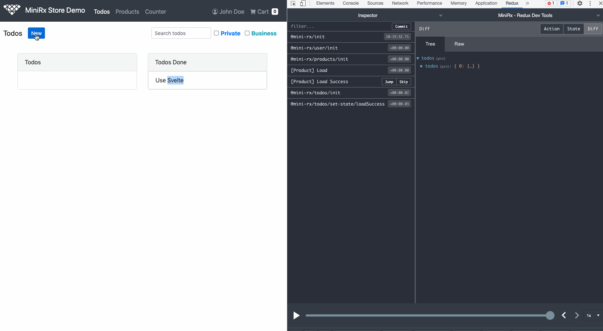

# MiniRx Store Demo (Svelte)
## See the MiniRx Redux Api and the Feature Stores in Action

MiniRx is a Redux Store based on RxJS.

RxJS plays nicely with Svelte: RxJS Observables expose a subscribe method (just like svelte stores).

MiniRx Store has some advantages compared to the native Svelte writable/readable/derived stores.

- State and state changes can be inspected with **Redux Dev Tools**
- Immutability of state can be enforced with the **Immutable Extension**
  - With immutable state we can be sure that state changes are done **explicitly** (using `setState` or by dispatching an Action)
  - We can enable `compilerOptions.immutable` in the rollup config to improve performance
- State is exposed as **RxJS Observable**. We can take advantage of RxJS operators to transform and combine state
- MiniRx has a **RxJS-based side effects** model: Let the action stream trigger side effects like API calls and handle race conditions with RxJS flattening operators
- Undo: You can easily undo state changes with the **Undo Extension**

🤓 Learn more about MiniRx on the [docs site](https://spierala.github.io/mini-rx-store)

Give it a ⭐  on [GitHub](https://github.com/spierala/mini-rx-store)

### Run the demo locally on your machine

- Install dependencies: `npm run install-dependencies`: It will install all dependencies for the Svelte frontend and the Strapi backend
- Run the Svelte frontend: `npm run start:front`
- Run the Strapi backend (in another terminal window): `npm run start:back`
### Todos

- Disable Store Extensions in PROD
- Host the demo on a server
